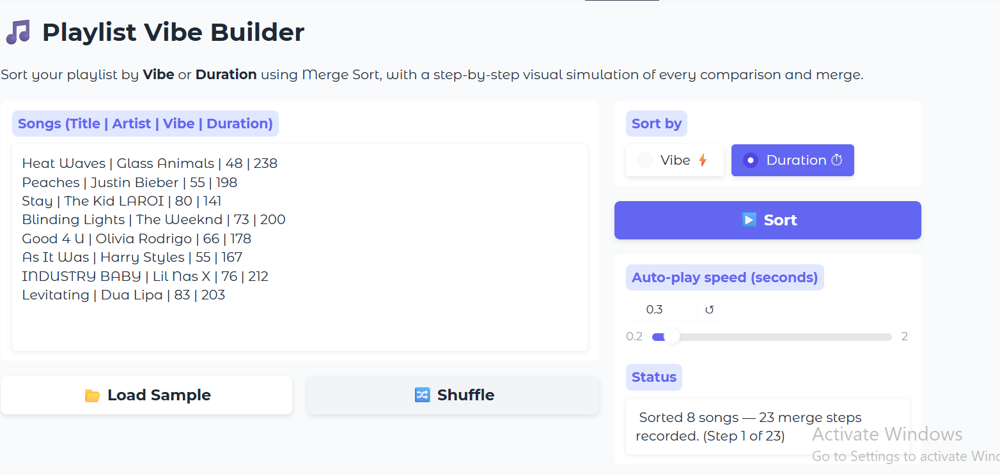
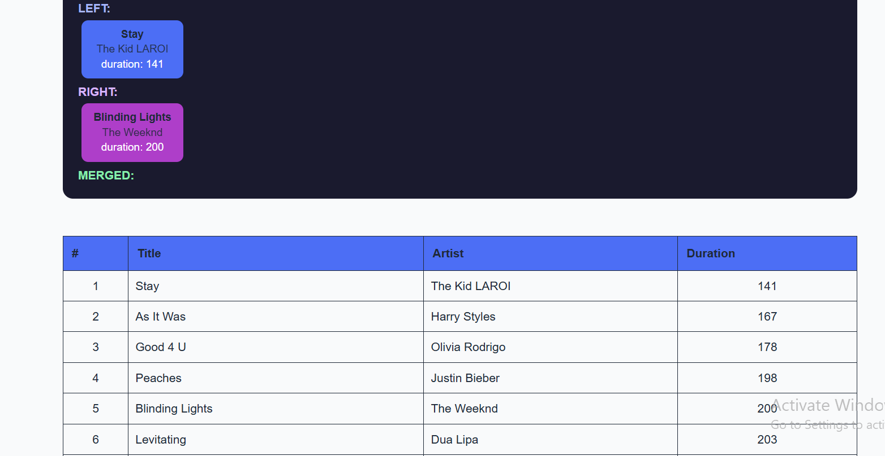
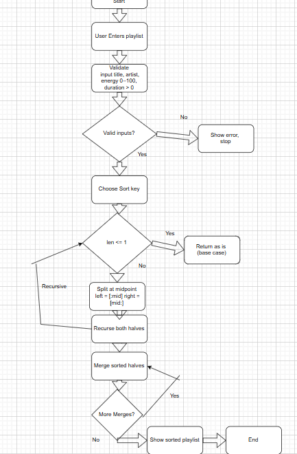

# Playlist Vibe Builder

**Sort your playlist by vibe using the Merge Sort algorithm!**

### Chosen Problem
This app allows users to sort a playlist of songs based on their vibe or duration to better organize music according to mood or listening preferences.

### Why Merge Sort?

Merge Sort is ideal for this project because it:

- Guarantees O(n log n) time in all cases.
- Produces a stable sort as songs with equal attribute values keep their original relative order.
- Has a clear plan of dividing → conquering → combining.

#### Demo

### Problem Breakdown & Computational Thinking (include a flowchart + the 4 pillars as brief bullets) 

Decomposition

Input — parse and validate the user's song list (title, artist, energy, duration).
Divide — recursively split the list in half until each sub-list has 1 song.
Conquer / Merge — compare the front elements of two sorted sub-lists; always pick the smaller one; repeat until both sub-lists are exhausted.
Record — capture each merge operation as a simulation "step" (left half, right half, result).
Output — display steps one at a time in the UI; show the final sorted playlist.

Pattern Recognition

i = 0, j = 0
while i < len(left) and j < len(right):
    if left[i][key] <= right[j][key]:
        result.append(left[i]); i += 1
    else:
        result.append(right[j]); j += 1
append remaining left[i:] and right[j:]

This pattern repeats at every level of the recursion tree — from single-song pairs all the way up to the full list.

Abstraction

Details shown to the user include: which songs are in the left/right halves, which songs end up in the merged result, the Step number, a plain-English description, and a final ranked playlist. Details that are hidden are: The recursion call stack, Internal index pointers (i, j), and memory storage and allocation.

Algorithm Design

The solution follows the divide-and-conquer strategy: 
(1) Divide the playlist at the midpoint
(2) Conquer by recursively sorting each half
(3) Combine by merging sorted halves using element-by-element comparison. Every split and merge is logged so the UI can replay the algorithm step by step.

### Steps to Run (local) + requirements.txt 

 ## Prerequisites

- Python 3.11 or higher
- pip (Python package manager)

## Installation & Launch

'''bash
# 1. Clone the repository
git clone https://github.com/YOUR_USERNAME/playlist-vibe-builder.git
cd playlist-vibe-builder

# 2. (Optional) Create a virtual environment
python -m venv venv
source venv/bin/activate         (macOS)
venv\Scripts\activate            (Windows)

# 3. Install dependencies
pip install -r requirements.txt

# 4. Run the application
python app.py

### Hugging Face Link 
You can access the live, interactive version of the app here:
[Click here to view the App on Hugging Face Space](https://huggingface.co/spaces/SillyLIama/playlist-vibe-builder)

### Testing (what you tried + edge cases) 

| Test case | Input | Expected output | Result |
| :--- | :--- | :--- | :--- |
| Normal sort by energy | 8 songs, random order | Ascending energy order | Pass |
| Normal sort by duration | 8 songs | Ascending duration order | Pass |
| Duplicate energy values | Two songs with energy=55 | Stable: original order preserved | Pass |
| Already sorted input | Songs already in energy order | Same order, no swap errors | Pass |
| Reverse-sorted input | Songs in descending energy | Correct ascending result | Pass |
| Single song | 1 song entered | Error: "at least 2 songs" | Pass |
| Missing field | Only 3 pipe-separated fields | Error: "expected 4 fields" | Pass |
| Non-integer duration | duration = "3min" | Error: "must be whole numbers" | Pass |
| Empty input | Blank text box | Error: "at least 2 songs" | Pass |

### Author & Acknowledgment (sources + AI use, if any) 

- Anuj Sharma-Sookdeo
- CISC 121 Winter 2026
- Used Gradio documentation
- Used Hugging Face for free hosting on Spaces
- Built with assistance from Microsoft Copilot, Gemini, ChatGPT, and Claude.
